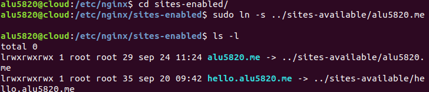
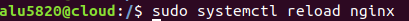
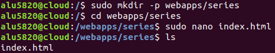
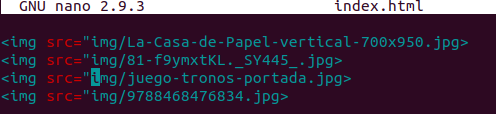
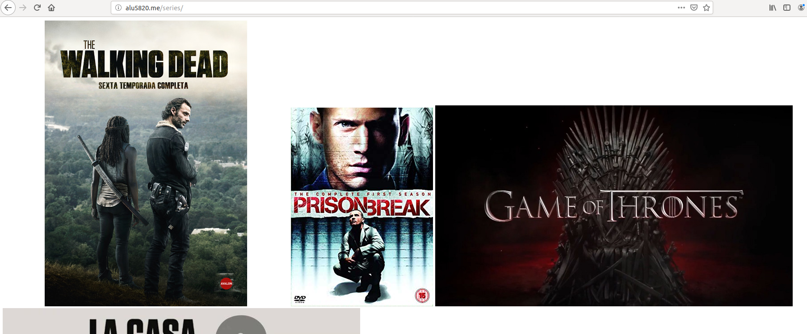
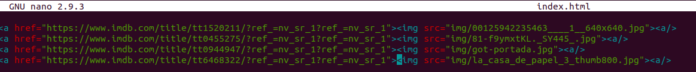

# Mis series favoritas.

Añadimos el fichero de configuración de Nginx que se encargará de las peticiones que se hagan a nuestro dominio (alu5820.me). Esto lo haremos dentro la carpeta Nginx, en sites available.

 Después de realizar esto procederemos a enlazar el fichero que hemos creado en los sites-enable para que esté disponible.

 

 A continuación recargaremos la configuración de Nginx.

 

 Ahora ya podremos empezar a personalizar nuestra página web en nuestro *home*.
Crearemos un index.html dentro del directorio webapps/series.

 

 Una vez creada la "base" para nuestra página web empezaremos a descargar imágenes de nuestras series favoritas para añadirlas al index. ESto lo podemos hacer ejecutando un "wget *url de la imagen*"

Ya descargadas las insertaremos en el index.html creado anteriormente.

Y quedaría así.

Por último le insertaremos enlaces a las imágenes que nos lleven a su respectiva página en IMDB.

Y así queda finalmente: [Mis series](http://alu5820.me/series/)
