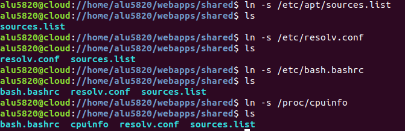
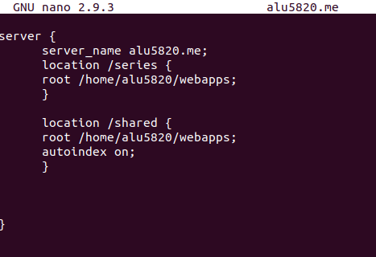
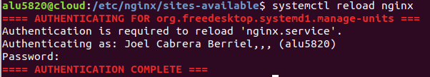
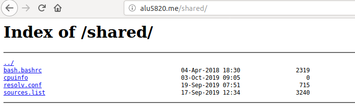

# Listado de directorios

Primero comenzamos creando la carpeta shared dentro del directorio /webapps .

Dentro del listado insertaremos los siguientes enalces, usando el comando *ln -s*
para así enlazar estos.

Ya enlazados entraremos al archivo alu5820.me, lo editaremos y añadimos lo siguiente:

Con esto podremos acceder al listado /shared con los enlaces creados anteriormente.

Por último haremos un *reload* al servicio Nginx para actualizar los cambios.

 Y comprobamos en el navegador si funciona correctamente.

 
