# Trabajo con virtual hosts.

La práctica consiste en crear 4 virtual hosts en Nginx con distintas configuraciones.
## Sitio web 1.
Debemos de crear *imw.alu5820.me* en sites-availables.
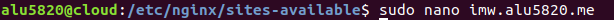

Dentro de este escribiremos lo siguiente: (nombre server, root)

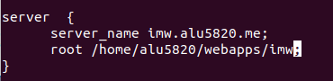

Ya hecho eso enlazaremos con el comando *ln -s* a *sites-enabled*
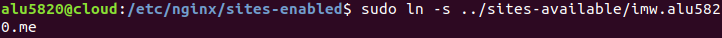

A continuación iremos a /webapps y crearemos *imw*. Dentro de este crearemos el index.

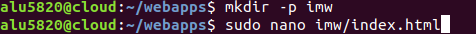

Descargaremos la imagen del Diagrama de unidades y la pondremos dentro del index.

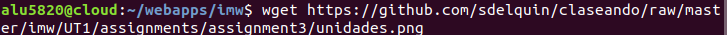

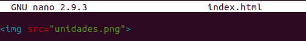

Y así saldrá la imagen.

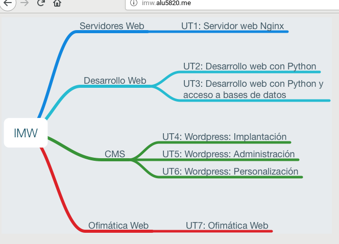

Hecho el primer paso procederemos al segundo.
Crearemos dentro de /webapps un directorio /mec el cual deberá tener un index para poner un enlace al Real Decreto.

Modificaremos *imw.alu5820.me* y le pondremos un location para añadir el /mec

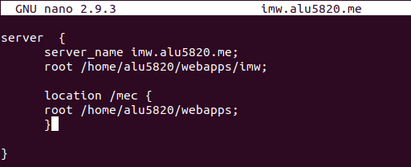

Modificamos el index y le pondremos el enlace correspondiente.

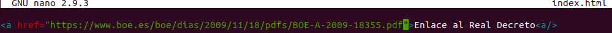

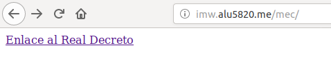

## Sitio web 2.
Comenzaremos creando *varlib.alu5820.me* siguiendo los pasos que hicimos anteriormente.

Enlazaremos y haremos reload para recagar la configuración
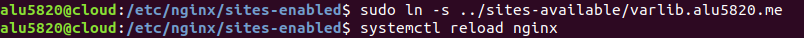

En el archivo del configuración de *varlib.alu5820.me* escribiremos el nombre del server, el root, y pondremos que podamos acceder usando el puerto 9000.

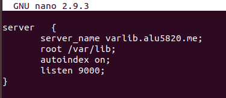

Y así sería el resultado:

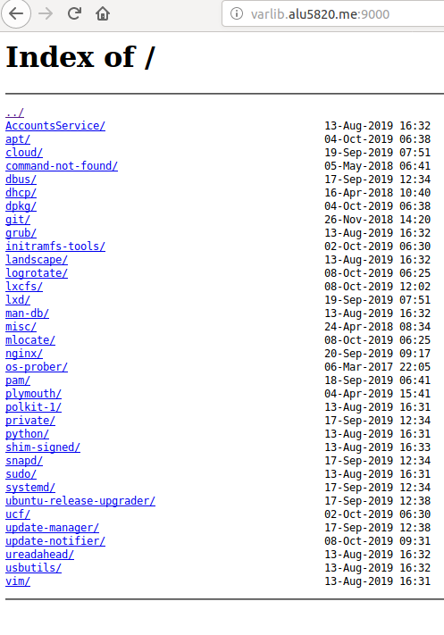

## Sitio web 3.
Crearemos *ssl.alu5820.me*

Para este sitio web tendremos que poner que nos pida usuario y contraseña para acceder. Haremos los siguientes comandos:

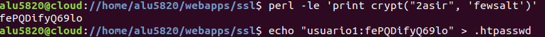

Se generará un archivo que en nuestro caso se almacenará en un fichero que tendremos en webapps llamado /ssl

Dentro de /webapps también debemos crear un fichero llamado /students en el que pondremos un index con el nombre de nuestros compañeros dentro.

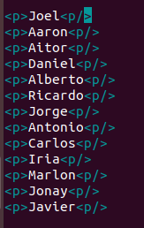

En el fichero de configuración del sitio web escribiremos el location.

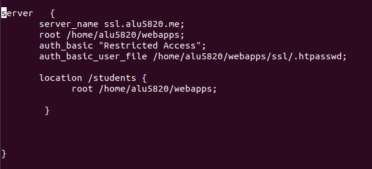

Comprobamos que funcione.

Ahora prohibiremos el acceso al fichero donde se aloja la contraseña.

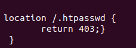

Para finalizar descargaremos *Certbot* para el certificado de nuestro sitio web.

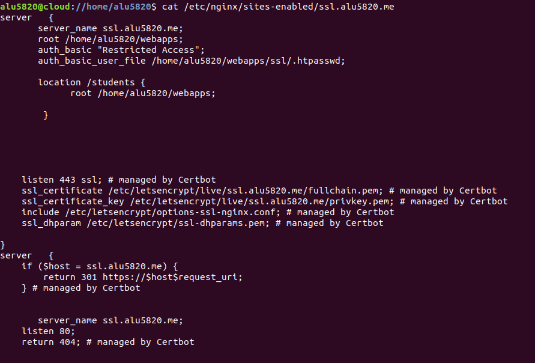

Por último comprobamos.

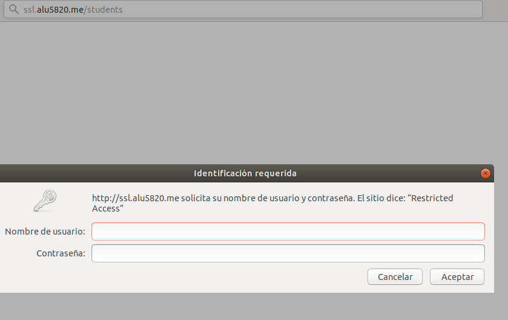

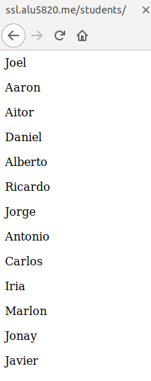

## Sitio web 4.
Crearemos dos sitios webs: target.alu5820.me , redirect.alu5820.me .

El fichero de configuración del sitio web redirect quedará así:

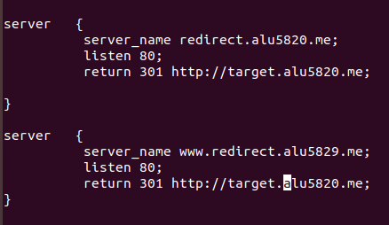

Comprobaremos que nos redirecciona correctamente al target.

Antes de modificar el del target crearemos un fichero en /webapps que le daremos un nombre (en nuestro caso /redirect)

Ya creado modificaremos el archivo de configuración:

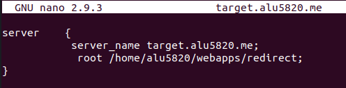

En el fichero creado anteriormente en /webapps descargaremos con el comando *wget* un archivo el cual tendremos que descomprimir usando *unzip* dentro de esta carpeta.

Accedemos al target y comprobamos que carga el archivo extraído:

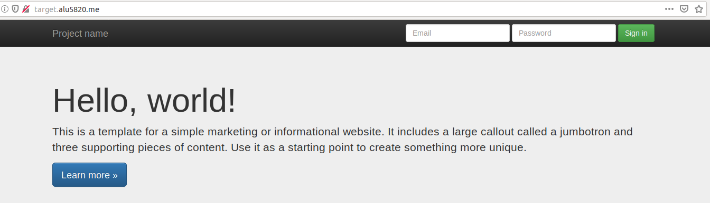

Por último insertaremos los logfiles (en el target):

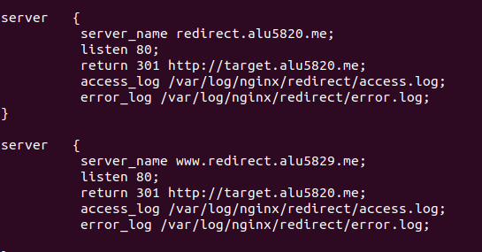
