# Sirviendo aplicaciones Php y Python.

Configuraremos dos sitios web en los que usaremos php y python.

# Sitio web 1.

Crearemos el sitio web *php.alu5820.me* y lo enlazamos correctamente.

Y añadimos la configuración necesaria para que nginx procese los archivos PHP.
Le añadiremos un index al index.php para obligar que el fichero índice sea el index.php

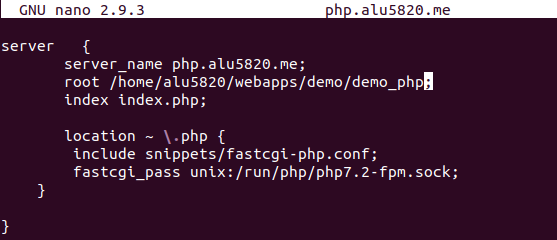

Tenemos que mostrar la aplicación **demo_php.zip**
Para ello crearemos *demo* en webapps.

Y dentro descomprimiremos la aplicación php.

![3]/img/3_unzip.png)

Haremos un reload al servicio Nginx y comprobamos que funcione la aplicación correctamente.

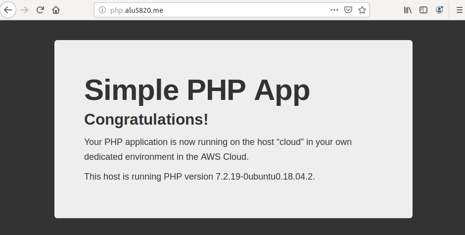

## Sitio web 2.

Para este sitio web debemos crear *now.alu5820.me*. Lo enlazamos y configuramos el sitio web.

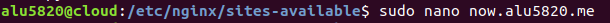

Añadiremos las líneas de configuración para que nginx procese las aplicaciones python.
También añadiremos un location *static* para que se almacenen los ficheros estáticos en el.

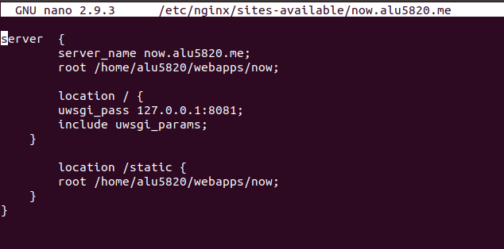

En webapps crearemos el directorio *now* en el que crearemos nuestra aplicación python.

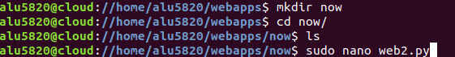

Tendrá el siguiente código.

Dentro del directorio *now* crearemos el entorno virtual utilizando el comando *pipenv*.
Instalaremos flask y pytz.

Ahora crearemos un script para activar el entorno virtual con el siguiente código.

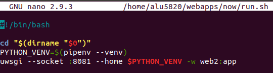

Le daremos permisos.

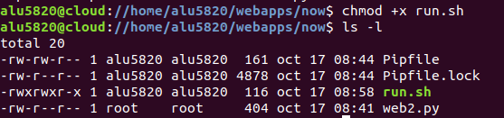

Ahora procederemos a configurar *supervisor*.
Para que nuestro programa sea gestionado por supervisor tenemos que añadir un fichero de configuración.

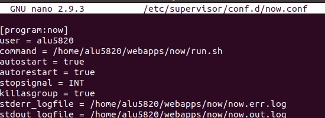

Ya configurado el supervisor realizaremos un par de comandos para ver la respuesta del navegador al acceder a la web.

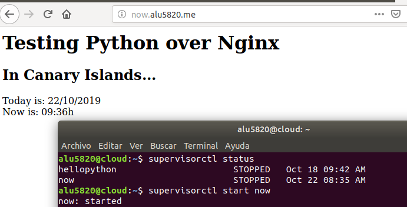

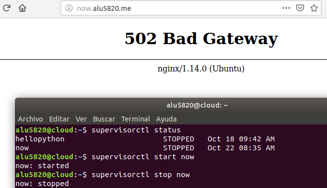

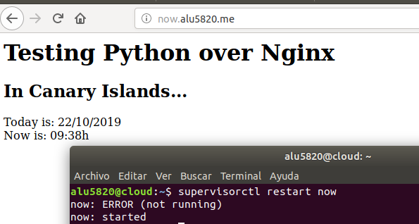
