# UT4-A1 Implantación de Worpdress

Comenzaremos creando la base de datos de Worpdress junto un usuario con acceso a esta en MySQL.

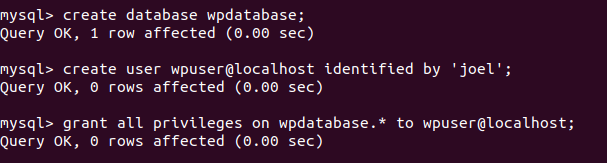

Descargaremos el código fuente de Wordpress desde su página web usando el comando *curl*.

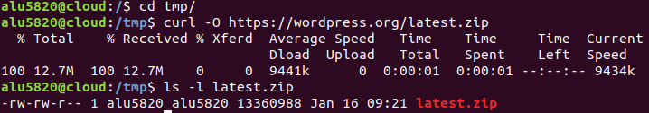

Posteriormente lo descomprimiremos.

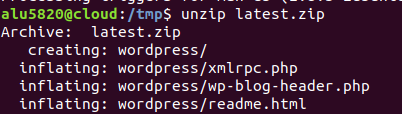

Y lo copiamos en la ruta */usr/share*

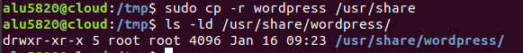

Le daremos permisos al usuario web *www-data* para que tenga acceso a estos ficheros.

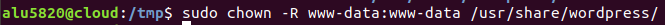

Ahora modificaremos el archivo de configuración de Wordpress para establecer el nombre de la base de datos, el usuario y la contraseña.

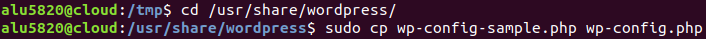

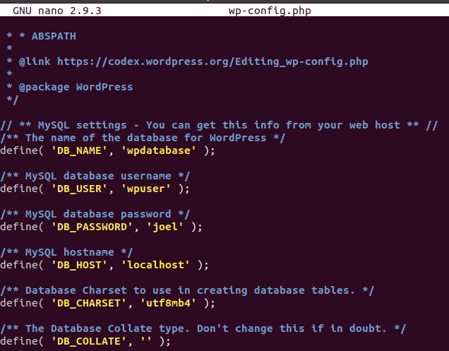

Crearemos un sitio web en Nginx con la siguiente configuración.

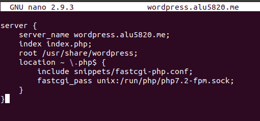

Enlazamos para habilitar el sitio web.

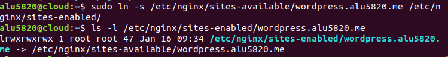

Reiniciamos el servicio y comprobamos que esté todo en funcionamiento.

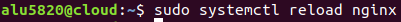

Entramos a la url del sitio que hemos creado y comprobamos que se nos abre el sitio para configurar Wordpress.

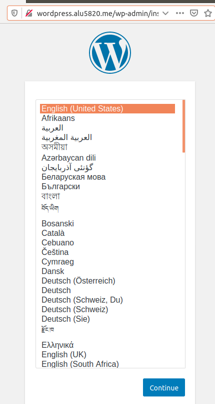

Y vamos configurando los distintos parámetros.

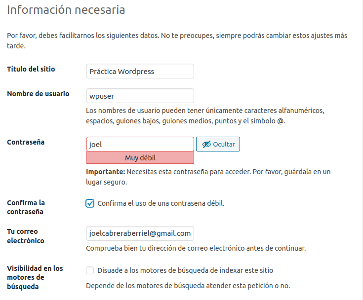

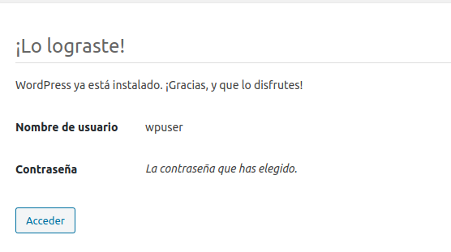

Ya configurado nos pedirá el usuario y clave que creamos anteriormente para poder acceder.

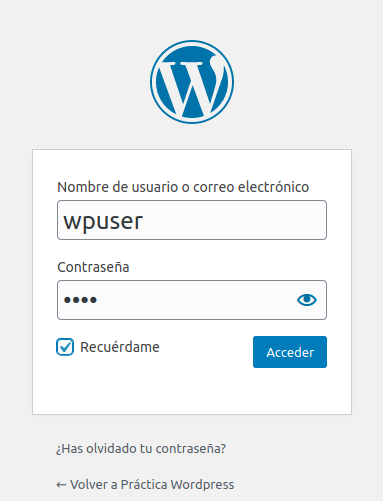

Lo primero que haremos será ir a la pestaña de - *Apariencia -> Temas* - y elegir un tema que nos guste.

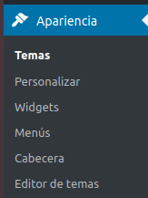

Y lo instalamos.

Ahora ajustaremos los permalinks. Seleccionamos - *Día y nombre* - y guardamos los cambios.

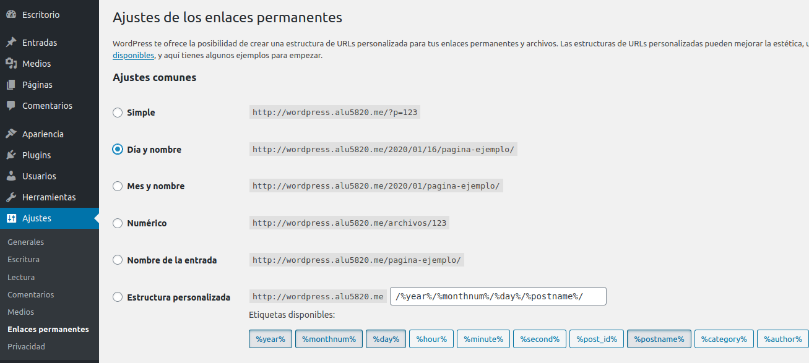

Ahora le indicaremos a Nginx que procese estas URLs que hemos creado. Modificamos el archivo de configuración del sitio web y añadimos lo siguiente:

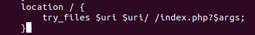

También configuraremos el límite de subida de archivos a Wordpress, ya que por defecto solo viene como máximo 2MB. Iremos al archivo *php.ini* y modificamos las siguientes líneas:

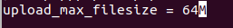

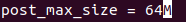

Reiniciamos el servicio.

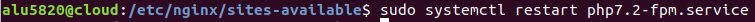

Además debemos añadir una línea al fichero de configuración de Nginx.

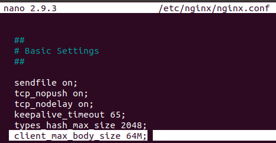

Ya configurado Worpdress procedemos a crear un sencillo Post con las estadísticas de Wordpress.

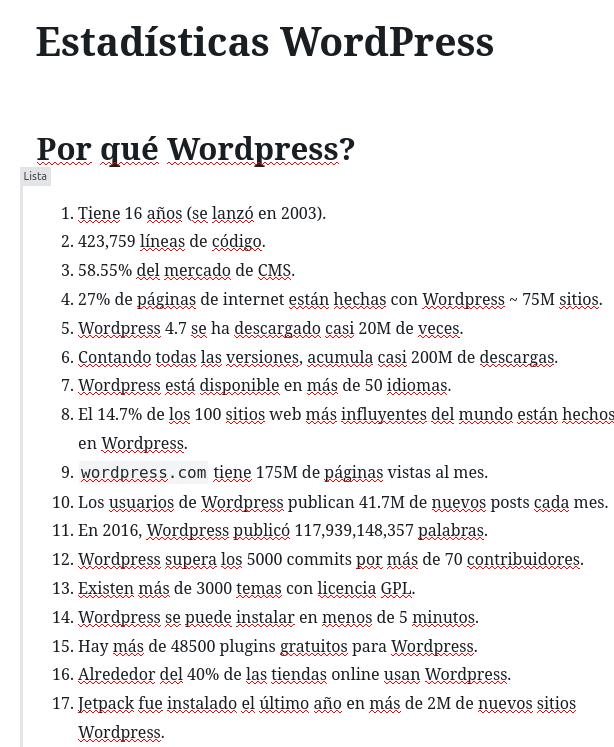

Y así quedaría la página con el tema y el Post que hemos escrito.

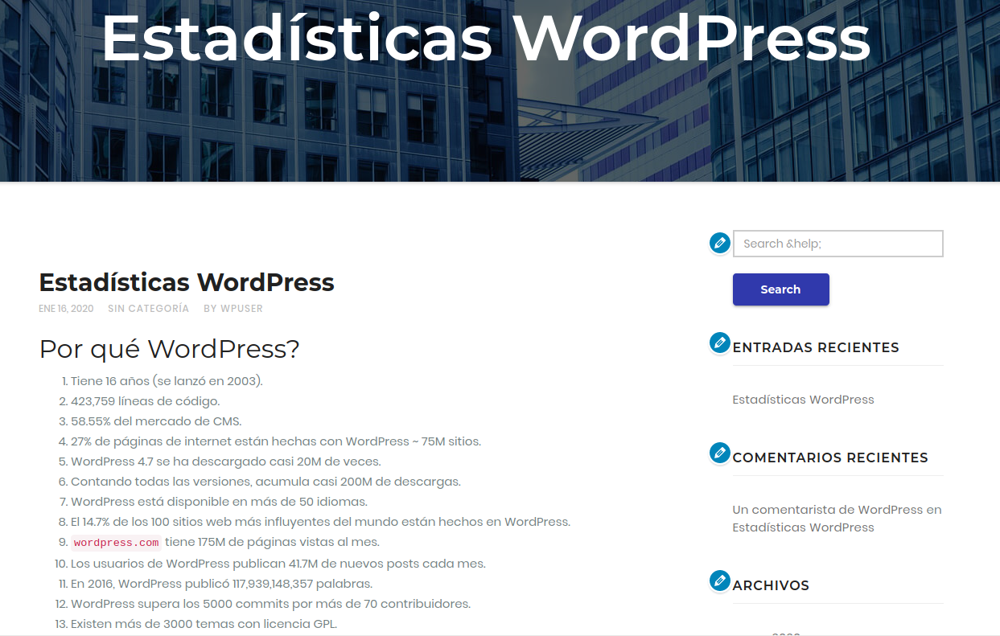

Por último le añadiremos un certificado a nuestro sitio web con Certbot.

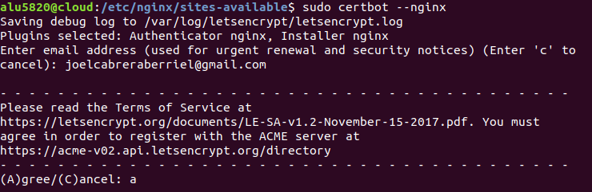

Así quedaría nuestra configuración del sitio web en Nginx:

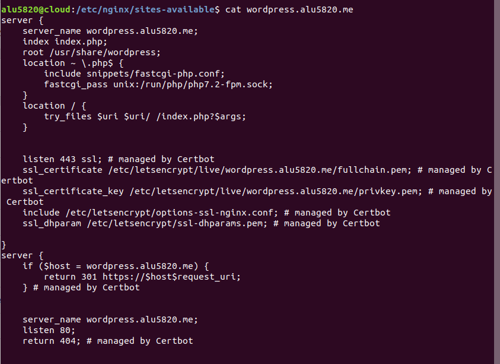

Y así nuestra página web con su certificado.

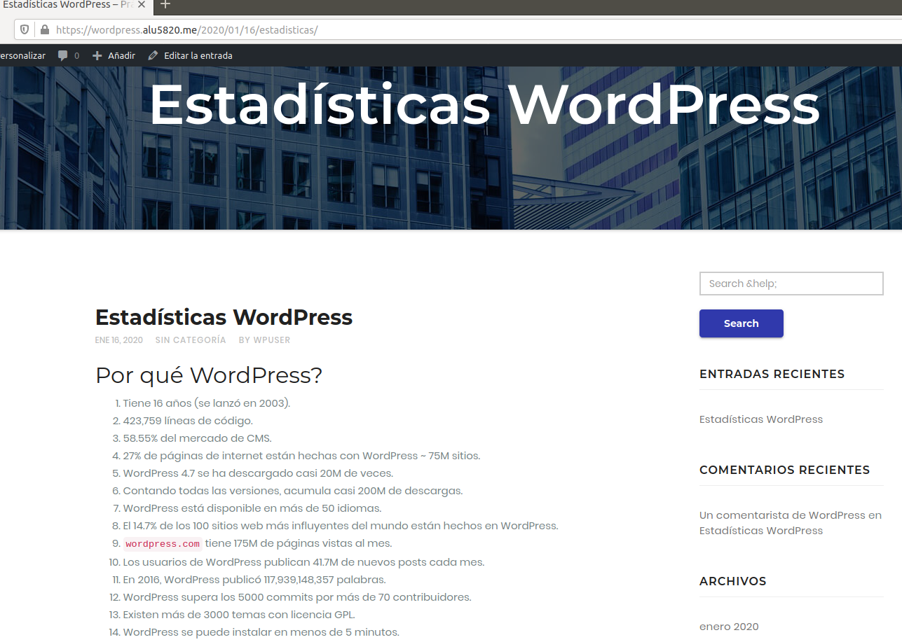

